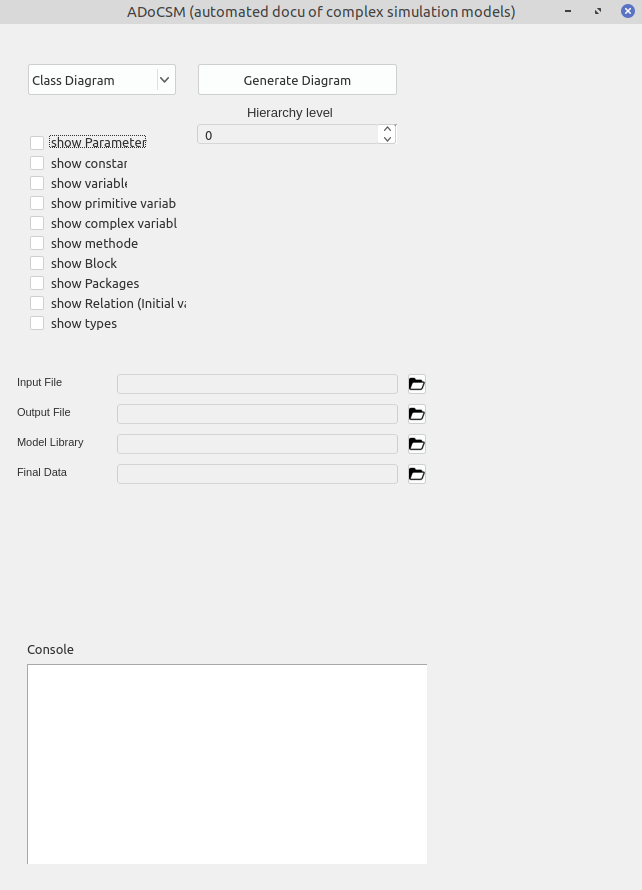

ADoCSM
======

**ADoCSM** is a Python tool that converts Modelica packages into a UML notation. This allows to easily understand the simulation model's structure.
The main idea is to provide a modelica file (.mo) from wich the program will generate a respective UML Diagram, e.g. a class or a sequence diagram.

## Installation and requirementes
To install the tool simply download the code or clone the repository to a local folder.

Python 3.8 and the python package PyQt5 are required. The program was tested on Windows.

## Usage
To use the program execute the python script `UML_GUI.py` located in `Automated_Documentation/UML_Diagram` either from within the console or with a tool like pycharm:

```bash
user@workstation:~/ADoCSM/Automated_Documentation/UML_Diagram$ python3 UML_GUI.py
```

The following window will open:



In the upper left menu the desired diagram type that should be generated can be selected. On the following item list the parameters that will be shown in the
final diagram can be selected.

To generate a diagram from a modelica file the following information has to be provided:
- *Input File*: Specify the path to the modelica file that you want to convert
- *Output File*: During the converting process, the program will generate various temporary files. These files have to be stored somewhere. The location
for the storage of this temporary data has to be specified here. The standard path is `ADoCSM/Automated_Documentation/UML_Diagram/Java_Klassen`.
- *Model Library*: Model Library describes the underlying logic that the program uses to interpret the modelica files. The path to the model library
has to be specified here, the standard path is `ADoCSM/Modelica_Library`
- *Final Data*: Specifiy the location of the final output file. The program will generate a java File which can be visualized.

After providing the necessary paths the diagram can be generated by clicking on the button `Generate Diagram` in the upper right area of the GUI.
If you didn't specify all the paths you will be prompted to input them.

The program will output a java file in the specified location containing the information of the diagram. This file can be easily visualized.
An easy way to visualize it is to use the tool plantUML (http://www.plantuml.com/plantuml/uml/SyfFKj2rKt3CoKnELR1Io4ZDoSa70000), which allows you
to save the diagram as an image file (e.g. PNG) as well. The java file has to be copied to plantUML and the tool will directly show the diragram.


### Acknowledgements

Parts of **ADoCSM** have been developed within public funded projects and with financial support by BMWi (German Federal Ministry for Economic Affairs and Energy).

### Version
0.1

The branch "error-fixes" from the original ADoCSM repository was integrated into this repository (X-HD), as it was denoted as the working branch by the original developer.
